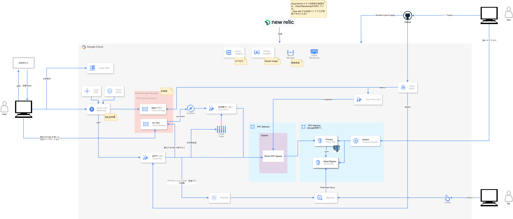

# Google Cloud

社内基幹システム・Web系サービスをGoogle Cloud上で構築する際のサンプルソース

## 基本構成

MVP〜初期グロース期であれば、この構成で十分戦えるはず。

- 枯れている技術スタック
  - 情報が豊富で、困ったときに調べやすい
  - チームメンバーが入れ替わっても、キャッチアップしやすい
- 運用負荷を最小化
  - マネージドサービス中心で、サーバー管理やミドルウェアのメンテナンスをできるだけ少なくする
  - 少人数チームでも無理なく運用できる
- 段階的なコスト設計
  - 小さく始めて、トラフィックに応じてスケール
  - 使った分だけ課金されるので、初期コストを抑えられる
- 長期的な拡張性・柔軟性
  - 一般的な社内基幹システム・Web系サービスなら数年単位で使い続けられる設計

### 別途検討が必要なケース

ただし、以下のような要件がある場合は別途検討が必要だと考えている

- 高トラフィック（秒間数万〜数十万リクエスト）
- 応答速度がシビア（数ミリ秒レベルの要求）
- GPUを使った処理や大規模バッチがメイン
- など

## 構成の深掘り

### フロント

- SPAにして、GCSに配置する。サーバーが必要になるSSR/SSGは採用しない。
- ブラウザアクセスはLBを経由し、Cloud CDNで静的コンテンツをキャッシュ配信。
- 非機能要件でIP制限などがあれば、Cloud ArmorとAccess Context Manager（以下ACM） + VPC Service Control（以下VPCSC）を併用する。
  - 考慮する点としては、LBを経由したアクセス・GCSへの直接アクセスそれぞれをどう制御するか。
  - Cloud Armorを利用すれば、前者のアクセス経路はブロックできる。かつ、地域制限なども設定できる。
  - ただし、Cloud Armorだけだと後者のアクセス経路がブロックできないため、ACM + VPCSCを併用する。
  - ※参考: [セキュリティポリシーの適用](https://cloud.google.com/blog/ja/products/identity-security/cloud-armor-adds-more-edge-security-policies-proxy-load-balancers#:~:text=%E3%82%A8%E3%83%83%E3%82%B8%20%E3%82%BB%E3%82%AD%E3%83%A5%E3%83%AA%E3%83%86%E3%82%A3%20%E3%83%9D%E3%83%AA%E3%82%B7%E3%83%BC%E3%81%8C%E3%82%AD%E3%83%A3%E3%83%83%E3%82%B7%E3%83%A5%E3%81%8B%E3%82%89%E3%81%AE%E6%8F%90%E4%BE%9B%E5%89%8D%E3%81%AB%E3%83%AA%E3%82%AF%E3%82%A8%E3%82%B9%E3%83%88%E3%82%92%E3%83%95%E3%82%A3%E3%83%AB%E3%82%BF%E3%83%AA%E3%83%B3%E3%82%B0)
- 追記: 2025年7月2日に「Bucket IP filtering for Cloud Storage」がGAとなったため、ACM + VPCSCを剥がせる可能性が高い。

### バックエンド

- コンテナ化してCloud Runで実行する。
  - 自動でスケールアウト/スケールインするので、アクセス頻度が少ない時間帯のコストを抑えられる。トラフィック切り替えもできるので、障害時の切り戻しなども容易。
  - APIアクセスでもLBを経由させることで、ドメインが同一かつパスで切り替えるといった構成が取れ、CORSの必要がない。
  - APIサーバーはI/Oバウンドな処理のみ実行し、CPUバウンドな処理はCloud Tasksを経由して非同期ワーカーに逃がす。
    - Cloud Tasksを選定している理由は、APIサーバー(Producer)と非同期ワーカー(Consumer)が1:1であること、流量制限・遅延実行が容易に設定できるため。
- DBはCloud SQLを使う。
  - 拡張性・柔軟性を優先してRDBMSを前提とする、かつフルマネージドで安価なリソースだとCloud SQLがファーストチョイスとなる。
  - FirestoreなどNoSQLは採用しない。必要になったタイミングで導入する。
- ログ出力はCloud Logging、Cloud Pub/Sub + BigQueryを併用する。
  - 考慮する点としては、ログ出力量によるCloud Loggingのコストが肥大化すること、個人情報など機微な情報をどのように扱うか。
  - 前者への対策として、そもそもログの設計時点から必要最低限のみ出力するようにする。とはいえ、トラブルシュートで多くのログを保管しておきたいため、一部のログをどこかへ退避させる。
  - 後者への対策として、アプリケーションロジックでマスクしてCloud Loggingへ流すなどの対策が必要。一方で、前者と同じ観点（トラブルシュート時）もある、かつ企業によってはログを数年間などに渡って管理しないといけないこともある（監査ログなどの要件）。
  - そこで、対象ログをアプリケーション実行時に非同期でBigQueryへ流すようにする。
  - BigQuery設定時の注意点としては、日付などで必ず「パーティショニングする」こと。パーティショニングをしないと、場合によってはTB級の情報量をスキャンすることになり、BigQueryでのクエリ実行時のコストが肥大化する。かつ、途中から適用することができないので要注意。
  - また、法的な保管義務のみでほぼ参照しないのであれば、GCSのArchive Storageに保管するのもアリ。
- 仮にバッチが必要であれば、Cloud Scheduler + Cloud Run Jobsを検討する。

### その他

- CI/CD
  - CIはGitHub Actions、CDはCloudBuild。
  - 考慮する点としては、Google Cloudへのセキュアなアクセス方法と、ランナーのスペックアップの難易度。
    - 前者をGitHub Actionsで実現しようとすると、Workload Identity Federationの設定が必要なので開発・運用が必要（GitHubのSecretにクレデンシャルを配置することもできるが非推奨）
    - 後者をGitHub Actionsで実現しようとすると、Self-Hosted Runnerが必要になり、こちらも開発・運用が必要。
  - CIで実行したいことはFmt/Lint/Build/Testが多く、Google Cloudへアクセスしないことが多い。そのため、GitHub Actionsで問題ない。
    - ただし、ビルド時間の高速化などでDockerイメージをGCSにキャッシュしたいなどの要件があれば前述した問題が発生する。
    - そのため、過去にはCIもCloud Buildに移行した経験がある。
  - CDで実行したいことはBuild/Deployが多く、Google Cloudへアクセスが必須になる。そのため、Cloud Buildを採用。
    - Cloud Buildを利用することでクレデンシャルを外に出さずに済み、かつランナーのスペックアップも容易。
- 認証基盤
  - 予算が許せばAuth0、厳しければFirebase Authentication。
  - 個人的には、可能な限りアウトソースしたいためIDaaSの採用を前提とする。なので、Better Authなど自前のDBで認証機能を構築・管理する系は採用しない。
  - Auth0は、よくあるEメール/パスワードやMFAだけでなく、ステップアップ認証など複雑な認証機能も兼ね備えている。ただし、コストが高い。
  - Firebase Authenticationも候補に上がるが、サービスレベルが定義されていないため要検討（過去にこの理由で採用不可になった経験がある）
- データ分析
  - BigQuery/Lookerを利用してもらう。
  - BigQueryのFederated Queryを使って、Cloud SQLを直接参照できる。
  - 構成図にてRead Repicaを参照先として設定している理由は、Biz側の分析時などに発行されるクエリの負荷がPrimaryに乗ることになり、システム影響が出る可能性があるため。
  - ただし、ここは想定負荷と予算との相談。個人的には、初期段階ではオーバーなのでPrimaryのみで進めるが、事業がスケールするにあたりDBのスケーリングが必要になるなどの可能性があることは伝達する。
- 監視、アラート
  - 無料枠でも十分機能してくれるNewRelicを採用。
  - DBのパフォーマンスなども参照できる。
  - ただし、開発メンバーの人数によってはNewRelicのアカウント発行でコストが高くなる。そういった事情でGoogle Cloudの監視・アラート機能を頼ることもある。

## Terraformガイドライン

- 主要リソース、ディレクトリ構造などは以下を参照。
- [Terraformガイドライン](./docs/terraform-guideline.md)
